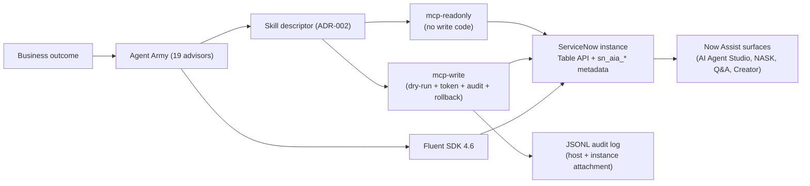

# ServiceNow Agent Army

> Council plus working app for the ServiceNow community. A battalion of specialist advisors, two MCP servers, and a knowledge base that help you build AI agents, GenAI skills, and agentic workflows on the platform — wired for Claude Agent SDK, Codex CLI, and ServiceNow SDK 4.6+ Fluent.

[](LICENSE)
[](https://nodejs.org/)
[](https://pnpm.io/)
[]()
[](https://www.servicenow.com/docs/r/zurich)


Now Assist, AI Agent Studio, NASK and AI Control Tower keep shipping new surfaces every family release. Builders end up with three problems: too many places to start, no consistent governance, and zero feedback loop for design quality. ServiceNow Agent Army is a public, MIT-licensed kit that gives you a curated council of advisors, two MCP servers with real guardrails, and a body of opinionated knowledge so the next agent or workflow you ship survives a CAB review and an internal audit.

## What it does

- Generates AI Agent Studio agent specs, validated workflow JSON, ATF test outlines, and Now Assist Skill Kit prompts in under two minutes from a business outcome.
- Wraps every production write behind dry-run, signed approval token, append-only audit, and per-record rollback through a write-side MCP server (see ADR-002).
- Ships a read-only MCP server for schema discovery, AI Agent Studio metadata browsing, and active-flow inventory without burning a Now Assist credit.
- Gives you 19 advisor prompts plus the SADA Framework, anti-patterns, and best-practice guides for ITSM, ITOM, CSM, and Now Assist.

## Who it helps

- **ServiceNow developer (junior or mid):** turn a one-line ask into a Fluent SDK plan, ATF tests, and a guided-setup checklist without guessing which surface to use.
- **Presales engineer / SC:** assemble a defensible demo with three architecture alternatives, trade-offs, and a SADA governance map in the time it takes to make coffee.
- **Technical Account Executive / Architect:** prepare account plans that align Now Assist roadmap, FSI compliance posture, and quick wins, then hand a clean spec to the platform team.

## The Agent Army (19 advisors)

| Group | Advisors | Primary output |
| --- | --- | --- |
| Strategy & architecture | CTA, Enterprise Architect, ServiceNow Architect Coach (SADA) | Three alternatives, trade-off table, ADR |
| Discovery & design | Business Analyst, Workflow Composer, Catalog Designer, Integration Mapper | Requirements, AI Agent Studio steps, catalog spec, integration pattern |
| Build & test | ServiceNow SDK Builder, ATF Test Generator, Knowledge Curator | Fluent scaffold, ATF suite + LLM-judge rubric, KB articles |
| Domain experts | ITSM, ITOM, CSM, Now Assist Coach | Three canonical use cases per domain mapped to Now Assist surfaces |
| Operations | Performance Tuner, Upgrade Advisor | Top 5 offenders, family upgrade path with risk matrix |
| Governance & comms | Guardrails Reviewer, Token Saver Specialist, Demo Storyteller | Approval gates, compressed prompts, demo scripts |

Full catalog: [`catalog/agents.json`](catalog/agents.json). Each advisor has a markdown card under [`agents/`](agents/) and a guardrail bound to its mission.

## Honest architecture

We refuse to pretend AI Agent Studio has a stable public CRUD API in April 2026. Each ServiceNow surface gets a deploy path picked from what the docs actually confirm.

| Capability | Surface | Deploy path | Confidence |
| --- | --- | --- | --- |
| Agentic workflow definition | AI Agent Studio | Fluent SDK 4.6 `AiAgentWorkflow` API + auto-ACL | confirmed (research-2026-04.md §3.4) |
| Now Assist custom skill | NASK | Fluent SDK 4.6 NASK APIs (input types `glide_record`, `simple_array`, `json_object`, `json_array`) | confirmed (research-2026-04.md §3.4) |
| AI Agent CRUD via REST | AI Agent Studio | Fluent first; otherwise Table API on `sn_aia_*` with explicit `--ai-agent-studio` flag | needs adapter (research-2026-04.md §4.3) |
| AI agent invocation from external system | AI Agent Studio runtime | REST with `sn_ais.agent_user` role + `com.glide.ai.runtime` plugin | confirmed (research-2026-04.md §4.3) |
| Now Assist Guardian policy | Guardian | UI configuration; policy-as-document in repo as companion | guided-only (research-2026-04.md §5.4) |
| Build Agent (vibe coding) | Now Assist for Creator | UI only; replicate locally via skills + Fluent | out-of-scope (research-2026-04.md §5.2) |
| Schema introspection, active flows, AI agent inventory | Platform tables | Read-only MCP server, no Now Assist credits | confirmed (mcp-landscape.md §5) |
| Production write to any table | Platform tables | Write MCP server with dry-run, approval token, audit, rollback | unique to this repo (mcp-landscape.md §5) |

Full matrix: [`docs/research-2026-04.md`](docs/research-2026-04.md) and [`docs/architecture.md`](docs/architecture.md).

## Quick start (60 seconds)

```bash
git clone https://github.com/paulopierrondi/servicenow-agent-army.git
cd servicenow-agent-army
pnpm install
pnpm validate
```

Use in Claude Code:

```text
Use the servicenow-agent-factory skill. Create an AI Agent Studio agent that triages incident records using Now Assist for ITSM. Domain: FSI, Brazilian compliance.
```

Use in Codex CLI:

```bash
codex run "Use the servicenow-agent-factory skill to draft a CMDB Health Check agentic workflow with guardrails."
```

Need a single new advisor card?

```bash
pnpm new:agent -- --id incident-triage-author --name "Incident Triage Author" \
  --role "Drafts triage logic for ITSM incidents" \
  --mission "Turn incident patterns into AI Agent Studio triage specs"
```

## MCP servers (Apr 2026)

The community ServiceNow MCP space is wide and shallow. Across nine inventoried servers — including the native Now Assist MCP Server (Zurich Patch 4) that gates access behind a Now Assist Pro Plus SKU and burns one assist per call — none ship a dry-run plus signed approval token plus append-only audit plus per-record rollback chain end-to-end. That is the gap we own. Detail: [`docs/mcp-landscape.md`](docs/mcp-landscape.md).

We split into two binaries on purpose. [`packages/mcp-readonly`](packages/mcp-readonly) (read-only by construction — no write code paths in the binary) covers `sn_table_query`, `sn_table_describe`, `sn_search_schema`, `sn_list_ai_agents`, `sn_list_active_flows`. [`packages/mcp-write`](packages/mcp-write) implements the dry-run plus approval-token plus audit plus rollback flow with `sn_table_patch_dryrun`, `sn_request_approval`, `sn_table_patch`, `sn_rollback`, `commit_audit_event`. Tool naming, error envelope, JWT approval token shape, and skill descriptor schema are pinned in [`docs/adr/ADR-002-skill-tool-contract.md`](docs/adr/ADR-002-skill-tool-contract.md).

Both servers ship `stdio` plus Streamable HTTP. SSE legacy is deprecated since spec 2025-03-26 and we will not implement it. OAuth 2.1 + PKCE is the default for the HTTP path, mirroring the auth and transport baseline of [`jschuller/mcp-server-servicenow`](https://github.com/jschuller/mcp-server-servicenow) translated to TypeScript.

## Knowledge base

Seven opinionated docs back the council:

- [`docs/sada-framework.md`](docs/sada-framework.md) — SADA v0.1, the four pillars (Data Fabric, Agent Ownership, Lifecycle, Governance) and a 15-item review checklist for FSI Brazil reality.
- [`docs/anti-patterns.md`](docs/anti-patterns.md) — ten production anti-patterns seen in the field with the fix for each.
- [`docs/now-assist-playbook.md`](docs/now-assist-playbook.md) — surface-by-surface routing for Now Assist Q&A, Code, Creator, NACM, AI Agent Studio, NASK.
- [`docs/best-practices/itsm.md`](docs/best-practices/itsm.md) — Incident, Change, Problem, Request: prefer OOTB, write justification rule, three canonical use cases.
- [`docs/best-practices/itom.md`](docs/best-practices/itom.md) — Discovery, Service Mapping, Event Management, AIOps with CMDB write-back guardrails.
- [`docs/best-practices/csm.md`](docs/best-practices/csm.md) — B2B vs B2C model split, deflection levers, PII boundary checks.
- [`docs/best-practices/now-assist.md`](docs/best-practices/now-assist.md) — credit budget pattern, Guardian policy template, BYOLLM trade-offs.

## Architecture (high level)



Full version with all five layers and the optional private submodule pattern: [`docs/architecture.md`](docs/architecture.md).

## Roadmap

| Milestone | Status | Description |
| --- | --- | --- |
| M1 — Catalog seed | done | 19 advisors, 7 knowledge docs, 2 ADRs landed |
| M2 — `mcp-readonly` MVP | in progress | Schema, AI agents, active flows; OAuth optional |
| M3 — `mcp-write` with guardrails | planned | Dry-run + JWT approval + audit + rollback per ADR-002 |
| M4 — Web app catalog + audit viewer | planned | Next.js 16 on Vercel free tier |
| M5 — Registry publish + plugin bundle | planned | Submit to MCP Registry, ship Claude/Codex plugin manifest |

Tracking happens in Linear (private board); milestone summaries land here on each cut.

## Repo layout

```text
servicenow-agent-army/
  agents/                  19 advisor markdown cards
  workflows/               JSON workflow specs
  catalog/                 agents.json + workflows.json (source of truth)
  prompts/                 reusable prompt packs
  templates/               new-agent / new-workflow scaffolds
  packages/
    mcp-readonly/          read-only MCP server
    mcp-write/             guarded write MCP server
    skill-contract/        shared types + Zod schemas (ADR-002)
    fluent-helpers/        wrappers around @servicenow/sdk
    audit-log/             audit envelope + JSONL writers
  apps/
    web/                   Next.js 16 catalog and audit viewer
    cli/                   Citty-based CLI (npm i -g @sn-army/cli)
  docs/
    adr/                   ADR-001 stack, ADR-002 contract
    best-practices/        itsm, itom, csm, now-assist
    research-2026-04.md    capability matrix, sources
    mcp-landscape.md       9-server inventory + gap analysis
    sada-framework.md      SADA v0.1
  scripts/                 validate-catalog.mjs, new-agent.mjs
  .agents/skills/          Codex-discoverable skills
  .claude/skills/          Claude-discoverable skills
  .claude/agents/          Claude subagent prompts
```

## Contribute

Read [`CONTRIBUTING.md`](CONTRIBUTING.md) before opening a PR.

- **Add an advisor:** `pnpm new:agent -- --id <id> --name "<Name>" --role "..." --mission "..."`. Edit the generated card under `agents/<id>.md`. The script appends the catalog entry and runs the validator.
- **Add a workflow:** copy `templates/workflow-spec.template.json` to `workflows/<id>.json`, update steps, append to `catalog/workflows.json` with the matching `steps` count, run `pnpm validate`.
- **Add a skill:** create `<skill>/SKILL.md` under both `.claude/skills/` and `.agents/skills/`, then add the path to `scripts/validate-catalog.mjs`. Both copies have to stay in sync — the validator enforces it.

## Not affiliated

Not affiliated with or endorsed by ServiceNow, OpenAI, or Anthropic. Brand and product names belong to their respective owners.

## License

MIT. See [`LICENSE`](LICENSE).

## Author

Paulo Pierrondi — Technical Account Executive at ServiceNow (FSI Brazil), Enterprise Architect background (ServiceNow, Oracle, Novartis), creator of the SADA Framework.

- GitHub: https://github.com/paulopierrondi
- LinkedIn: https://www.linkedin.com/in/paulopierrondi/

---

## Em portugues (Brasil)

### O que e

Conselho mais app real para a comunidade ServiceNow. Um batalhao de 19 agentes especialistas, 2 servidores MCP com guardrails de verdade, e uma base de conhecimento opinativa que ajudam voce a criar AI agents, GenAI skills e agentic workflows direto na plataforma — usando Claude Agent SDK, Codex CLI e ServiceNow SDK 4.6+ Fluent.

A cada release, ServiceNow adiciona Now Assist, AI Agent Studio, NASK e AI Control Tower em camadas independentes. O builder fica com tres problemas: pontos de partida demais, governanca inconsistente, e zero feedback loop para qualidade de design. Esse repo resolve isso com tres entregaveis: prompt packs revisados por pares (CTA, EA, Guardrails), MCP servers que separam leitura de escrita por construcao, e docs que sobrevivem a uma auditoria do BACEN em 24h.

### Para quem ajuda

- **Desenvolvedor ServiceNow (junior ou pleno):** transforma uma frase de pedido em um plano Fluent SDK, suite ATF e checklist de guided setup sem chutar qual surface usar.
- **Presales / SC:** monta uma demo defensavel com tres alternativas de arquitetura, trade-offs e mapa SADA de governanca em poucos minutos.
- **TAE / Arquiteto:** prepara account plan alinhado com roadmap Now Assist, postura de compliance FSI, e entrega spec limpa para o time de plataforma do cliente.

### Quick start

```bash
git clone https://github.com/paulopierrondi/servicenow-agent-army.git
cd servicenow-agent-army
pnpm install
pnpm validate
```

No Claude Code:

```text
Use the servicenow-agent-factory skill. Create an AI Agent Studio agent that triages incident records using Now Assist for ITSM. Dominio: FSI, compliance Brasil.
```

No Codex CLI:

```bash
codex run "Use the servicenow-agent-factory skill to draft a CMDB Health Check agentic workflow with guardrails."
```

### O batalhao em 1 paragrafo

19 advisors organizados em seis grupos: estrategia e arquitetura (CTA, EA, SADA Coach), discovery e design (BA, Workflow Composer, Catalog Designer, Integration Mapper), build e test (SDK Builder, ATF Test Generator, Knowledge Curator), especialistas de dominio (ITSM, ITOM, CSM, Now Assist Coach), operacoes (Performance Tuner, Upgrade Advisor) e governanca/comunicacao (Guardrails Reviewer, Token Saver Specialist, Demo Storyteller). Cada advisor tem missao, guardrail e output bem definidos em [`catalog/agents.json`](catalog/agents.json).

### Nao afiliado

Sem vinculo oficial com ServiceNow, OpenAI ou Anthropic. Marcas e nomes pertencem aos seus donos.
