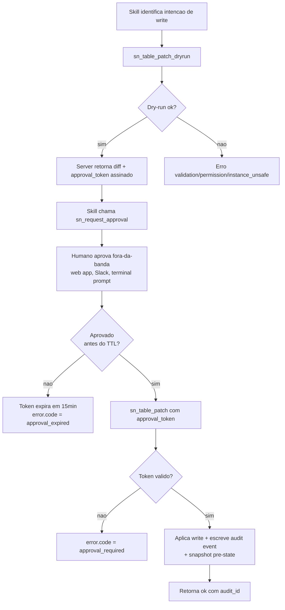

# ADR-002: Contrato skill -> tool -> MCP com guardrails

- Status: accepted
- Date: 2026-04-26
- Deciders: Paulo Pierrondi (TAE FSI Brazil, lead)
- Context source: docs/research-2026-04.md, docs/mcp-landscape.md
- Depende de: ADR-001 (stack Node + TS + `@modelcontextprotocol/sdk`)

## Context

O batalhao tem N agents especialistas. Cada agent tem skills (Claude `SKILL.md` em `.claude/skills/`, Codex em `.agents/skills/`) que orientam comportamento e declaram quais tools MCP podem ser invocadas. Os tools vivem em **dois MCP servers**:

- **mcp-discovery** (read-only by construction). Sem caminhos de write no binario.
- **mcp-write** (com guardrails: dry-run -> approval token -> audit -> rollback).

O gap mapeado em mcp-landscape.md secao 5 e claro: **nenhum dos 9 servidores ServiceNow MCP publicos faz dry-run -> approval -> audit -> rollback end-to-end**. Native Now Assist MCP (Zurich Patch 4) fica atras de Now Assist Pro Plus e cobra por chamada. Community servers (echelon, Happy Platform, jschuller, habenani-p) cobrem CRUD mas delegam governance para ACLs ServiceNow (post-hoc, nao MCP-aware).

Nosso diferencial competitivo so existe se o contrato skill -> tool -> MCP for **explicitamente seguro por construcao** e **rastreavel sem dependencia da SN sys logs**. Esse ADR fixa esse contrato.

Restricoes derivadas da pesquisa:

- Claude Agent SDK so deixa `Skill` invocar tool se `allowedTools` listar (research-2026-04.md secao 1.4). Isso significa que a skill **declara** tools mas o host pode bloquear.
- Codex Skills tem progressive disclosure capped em ~2% do context (~8000 chars) (research-2026-04.md secao 2.1). SKILL.md precisa ser denso e com frontmatter rico.
- MCP tool naming default e `mcp__<server>__<tool>` (research-2026-04.md secao 1.5). Nossos tools devem ser nomeaveis e wildcard-able (`mcp__sn-write__sn_table_*`).
- AI Agent Studio orquestracao real ainda e UI-bound (research-2026-04.md secao 4.3). Toda tentativa de write em `sn_aia_*` precisa passar pelo nosso fluxo de aprovacao porque NAO podemos confiar que existe API oficial.

## Decision

### 1. Skill descriptor format

Cada skill em `.claude/skills/<name>/SKILL.md` (ou `.agents/skills/<name>/SKILL.md`) tem frontmatter YAML estendido:

```yaml
---
name: incident-triage-architect
description: Triages production incidents in ITSM, proposes priority and assignment group based on schema introspection. Read-only.
version: 1.0.0
agents:
  - itsm-architect
  - sre-on-call
mcp_servers:
  required:
    - sn-discovery
  optional: []
tools:
  read:
    - mcp__sn-discovery__sn_table_query
    - mcp__sn-discovery__sn_table_describe
    - mcp__sn-discovery__sn_aggregate_count
  write: []
guardrails:
  side_effects: none
  audit_required: false
  approval_required: false
---
```

Para skills que escrevem:

```yaml
---
name: change-request-author
description: Drafts and proposes change requests with dry-run + human approval. Production write surface.
version: 1.0.0
agents:
  - change-author
mcp_servers:
  required:
    - sn-discovery
    - sn-write
tools:
  read:
    - mcp__sn-discovery__sn_table_query
    - mcp__sn-discovery__sn_table_describe
  write:
    - mcp__sn-write__sn_table_patch_dryrun
    - mcp__sn-write__sn_request_approval
    - mcp__sn-write__sn_table_patch
    - mcp__sn-write__sn_rollback
guardrails:
  side_effects: write
  audit_required: true
  approval_required: true
  approval_ttl_minutes: 15
  rollback_supported: true
---
```

Regras:

- `tools.read` e `tools.write` sao **listas explicitas**. Wildcard (`mcp__sn-discovery__*`) so e permitido em skills marcadas como `side_effects: none`.
- `mcp_servers.required` controla `mcpServers` no host: se servidor nao estiver carregado, skill e rejeitada com mensagem clara.
- `guardrails.audit_required: true` forca a skill a chamar `commit_audit_event` apos cada operacao write.
- `guardrails.approval_required: true` forca o pipeline dry-run -> approval -> commit.

### 2. Tool naming convention

Padrao: `sn_<resource>_<verb>[_<modifier>]`

| Tool | Server | Side-effect | Proposito |
| --- | --- | --- | --- |
| `sn_table_query` | discovery | read | GlideRecord-style query com encoded query string |
| `sn_table_get` | discovery | read | Single record por sys_id |
| `sn_table_describe` | discovery | read | Schema + ACL effective para caller |
| `sn_aggregate_count` | discovery | read | Count com group-by |
| `sn_search_schema` | discovery | read | Busca tabelas/campos por nome ou label |
| `sn_list_ai_agents` | discovery | read | Inventory `sn_aia_*` sem consumir Now Assist |
| `sn_list_active_flows` | discovery | read | Active flows + agentic workflows metadata |
| `sn_table_patch_dryrun` | write | none (preview) | Computa diff e retorna `approval_token` |
| `sn_request_approval` | write | none | Emite link/codigo de aprovacao para humano |
| `sn_table_patch` | write | **write** | Aplica patch SE token valido |
| `sn_table_create` | write | **write** | Cria record SE token valido |
| `sn_table_delete` | write | **write** | Soft-delete (com snapshot) SE token valido |
| `sn_rollback` | write | **write** | Reverte por `audit_id` |
| `commit_audit_event` | write | **write** | Append-only no audit log |

Justificativas:

- Prefixo `sn_` evita colisao com tools de outros MCP servers (mcp-landscape.md secao 2 menciona Cursor com cap de ~40 tools por workspace).
- Verbos `_dryrun`, `_query`, `_get`, `_patch`, `_create`, `_delete`, `_rollback` sao consistentes; LLM aprende padrao rapido.
- Nenhum verbo `_run` ou `_execute` ambiguo. Nada de `do_things`.

### 3. Approval flow

Dry-run **sempre** primeiro. Tool de write **sempre** exige `approval_token` valido.



Detalhes:

- **`approval_token`** e JWT assinado HS256 por chave em env (`SN_AGENT_ARMY_SIGNING_KEY`). Payload: `{tid: dryrun_hash, sub: actor_id, aud: tool_name, iat, exp, scope: {table, sys_ids[], op}}`.
- TTL **15 minutos** default. Configuravel por skill via `guardrails.approval_ttl_minutes` (max 60, min 1).
- Nonce + dryrun_hash garantem que aprovacao vincula **aquele patch exato**. Se diff mudar, token e invalido.
- Storage: stateless por padrao (JWT autocontido). Opcional: tabela ephemeral `x_snw_agent_army_approval` na instancia para auditoria server-side. Decisao default = stateless (vide ADR-001 "Streamable HTTP session model" e mcp-landscape.md secao 6 Q2).

### 4. Audit log shape

Linhas JSONL append-only. Em prod gravadas em (a) Vercel KV com TTL longo, (b) attachment em tabela `x_snw_agent_army_audit_log` na instancia.

```json
{
  "timestamp": "2026-04-26T14:32:11.482Z",
  "audit_id": "aud_01HXYZABC123",
  "actor": "user:pierrondi@gmail.com",
  "agent": "change-author",
  "skill": "change-request-author",
  "host": "claude-code-1.0.123",
  "mcp_server": "sn-write",
  "tool": "sn_table_patch",
  "instance": "https://acme.service-now.com",
  "input": {
    "table": "change_request",
    "sys_id": "abc123...",
    "fields": {"state": "scheduled", "assignment_group": "..."}
  },
  "input_hash": "sha256:...",
  "dryrun_hash": "sha256:...",
  "approval_token_id": "tid_...",
  "approved_by": "user:cab-lead@acme.com",
  "approved_at": "2026-04-26T14:30:55.000Z",
  "output_summary": {
    "rows_affected": 1,
    "before_snapshot_id": "snap_01HXYZABC120",
    "result": "ok"
  },
  "outcome": "applied",
  "duration_ms": 412,
  "error": null
}
```

Regras:

- **Append-only**. Nunca sobrescrever. Operacoes corretivas sao novos eventos com `outcome: "rolled_back"`.
- `input_hash` permite diff fingerprinting sem expor PII.
- `before_snapshot_id` aponta para snapshot pre-write usado em rollback.
- `outcome` enum: `applied | dryrun | rejected | rolled_back | failed`.
- `actor` e `approved_by` sao opaque ids; deciframento so com chave do operador.

### 5. Rollback

Rollback e tool de primeira classe `sn_rollback({audit_id})`. Mecanismo:

1. `sn_table_patch_dryrun` calcula diff E captura snapshot pre-state dos campos afetados.
2. Snapshot armazenado com `before_snapshot_id` referenciado no audit event.
3. `sn_rollback` busca snapshot, gera contra-patch, aplica via mesmo pipeline (com audit, mas pulando approval flow se `rollback_within_ttl` configurado, default 60min).
4. Eventos em chain: `applied` -> `rolled_back`. Rollback de rollback = re-apply, gera novo audit event.

Limites:

- **Per-record only** no MVP. Multi-record transactional rollback (mcp-landscape.md secao 6 Q4) e open question.
- **Nao reverte side-effects de Business Rules** que dispararam por causa do write. Se BR criou registros downstream, rollback so mexe no campo principal. Documentado em mensagem do tool.
- **Nao reverte AI Agent Studio executions** (se patch alterou config de agent que ja rodou execution). Open question.

### 6. Error envelope

Todas as tools retornam `{ok, data?, error?}`. Nunca mistura.

```typescript
type ToolResult<T> =
  | { ok: true; data: T; audit_id?: string }
  | { ok: false; error: ToolError };

type ToolError = {
  code: ErrorCode;
  message: string;          // human-readable, EN
  message_pt_br?: string;   // optional pt-BR for client-facing
  retryable: boolean;
  details?: Record<string, unknown>;
};

type ErrorCode =
  | "auth"               // token invalido/expirado para a instancia SN
  | "permission"         // ACL nega operacao no SN
  | "validation"         // input nao casa schema
  | "dryrun_required"    // tentou write sem dryrun
  | "approval_required"  // sem approval_token valido
  | "approval_expired"   // token TTL estourado
  | "approval_mismatch"  // token nao casa com diff atual
  | "not_found"          // record/table inexistente
  | "rate_limited"       // 429 da instancia ou backoff interno
  | "instance_unsafe"    // heuristica detectou prod sem flag --allow-prod
  | "rollback_failed"    // snapshot indisponivel ou contra-patch invalido
  | "internal";          // bug
```

`retryable: true` so para `auth` (refresh token) e `rate_limited` (backoff). Resto exige acao do agent ou humano.

### 7. JSON Schema

Schema TypeScript canonico em `packages/skill-contract/src/skill-descriptor.schema.ts`. Versao JSON Schema (Draft 2020-12) gerada via `zod-to-json-schema`.

Esqueleto Zod:

```typescript
import { z } from "zod";

export const SideEffect = z.enum(["none", "read", "write"]);

export const ToolDescriptor = z.string().regex(
  /^mcp__[a-z0-9-]+__[a-z0-9_]+$/,
  "tool descriptor must match mcp__<server>__<tool>"
);

export const Guardrails = z.object({
  side_effects: SideEffect,
  audit_required: z.boolean(),
  approval_required: z.boolean(),
  approval_ttl_minutes: z.number().int().min(1).max(60).optional(),
  rollback_supported: z.boolean().optional(),
}).refine(
  (g) => !g.approval_required || g.audit_required,
  { message: "approval_required implies audit_required" }
).refine(
  (g) => g.side_effects !== "write" || g.audit_required,
  { message: "side_effects=write requires audit_required" }
);

export const SkillDescriptor = z.object({
  name: z.string().regex(/^[a-z0-9-]+$/),
  description: z.string().min(20).max(1024),
  version: z.string().regex(/^\d+\.\d+\.\d+$/),
  agents: z.array(z.string()).min(1),
  mcp_servers: z.object({
    required: z.array(z.string()),
    optional: z.array(z.string()).default([]),
  }),
  tools: z.object({
    read: z.array(ToolDescriptor).default([]),
    write: z.array(ToolDescriptor).default([]),
  }),
  guardrails: Guardrails,
});

export type SkillDescriptor = z.infer<typeof SkillDescriptor>;
```

Validacao roda:

- No `now-army validate` CLI command (CI gate).
- No host MCP startup (rejeita skill malformada com warning).
- No publish do plugin para registry interno.

### 8. Exemplo end-to-end concreto

Skill `change-request-author` cria CR de janela.

```jsonc
// 1. Agent chama dry-run
// tool: mcp__sn-write__sn_table_patch_dryrun
{
  "table": "change_request",
  "op": "create",
  "fields": {
    "short_description": "Aplicar patch de seguranca em prod-app-01",
    "type": "normal",
    "category": "Hardware",
    "start_date": "2026-04-30T22:00:00Z",
    "end_date": "2026-04-30T23:30:00Z",
    "assignment_group": "ITOps"
  }
}

// Resposta:
{
  "ok": true,
  "data": {
    "diff": {
      "before": null,
      "after": { "...": "..." },
      "computed_fields": { "number": "CHG0030001 (predicted)" }
    },
    "approval_token": "eyJhbGciOiJIUzI1NiIs...",
    "approval_token_expires_at": "2026-04-26T14:47:00Z",
    "approval_request_url": "https://agent-army.app/approve/req_01HXYZ...",
    "dryrun_hash": "sha256:..."
  }
}
```

```jsonc
// 2. Agent chama request_approval (notifica humano via Slack/email/web)
// tool: mcp__sn-write__sn_request_approval
{
  "approval_token": "eyJhbGciOiJIUzI1NiIs...",
  "channel": "slack",
  "approver": "cab-lead@acme.com",
  "context": "Patch crítico, janela já validada com SecOps"
}

// Resposta:
{ "ok": true, "data": { "approval_request_id": "req_01HXYZ..." } }
```

```jsonc
// 3. Humano aprova via web app -> backend assina segunda metade do token
// 4. Agent chama o write
// tool: mcp__sn-write__sn_table_patch
{
  "approval_token": "eyJhbGciOiJIUzI1NiIs...",
  "table": "change_request",
  "op": "create",
  "fields": { "...": "..." }
}

// Resposta:
{
  "ok": true,
  "data": {
    "sys_id": "abc123...",
    "number": "CHG0030001",
    "before_snapshot_id": "snap_01HXYZ...",
    "audit_id": "aud_01HXYZABC123"
  }
}
```

```jsonc
// 5. Se algo deu errado (e.g. CR rejeitado pelo CAB depois)
// tool: mcp__sn-write__sn_rollback
{ "audit_id": "aud_01HXYZABC123" }

// Resposta:
{
  "ok": true,
  "data": {
    "audit_id": "aud_01HXYZABC130",
    "outcome": "rolled_back",
    "rolled_back_audit_id": "aud_01HXYZABC123"
  }
}
```

## Consequences

### Positivas

- **Single point of enforcement**: skill descriptor declara intencao, MCP server enforca. Nao depende de prompt-level discipline do agent.
- **Audit MCP-aware**: ServiceNow sys logs mostram a operacao final mas nao o "porque" (qual agent, qual skill, qual approver). Nosso JSONL preenche o gap (mcp-landscape.md secao 5 destaca esse vazio).
- **Approval out-of-band**: humano aprova via web app/Slack, nao confiando no agent. Mitiga risco de prompt injection escalar para write.
- **Read-only-by-construction**: discovery server **nao tem codigo de write**. Compromise de prompt nao consegue escrever (mcp-landscape.md secao 5 lista isso como gap unico nosso).
- **Rollback como tool**: torna recovery rotineiro, nao excepcional.
- **Schema versionado**: skill descriptors evoluem com semver; breaking changes sao explicitas.
- **Compativel com hosts MCP existentes**: tool naming `mcp__sn-<server>__sn_<resource>_<verb>` funciona em allowedTools wildcards do Claude Agent SDK (research-2026-04.md secao 1.5) e enabled_tools do Codex (research-2026-04.md secao 2.4).

### Negativas (aceitas)

- **Friccao de UX**: cada write exige 2-3 chamadas (dry-run + request_approval + patch). Em demos, isso e ~30-60s a mais de loop. Aceito porque o publico-alvo e enterprise FSI onde governance > velocidade.
- **Approval token signing key vira critical secret**: rotacao precisa ser planejada. Mitigacao: rotacao trimestral, double-key window de 24h.
- **Snapshot storage cresce**: cada dry-run salva pre-state. Mitigacao: TTL 30 dias + compressao + retencao mais longa so para audits "applied".
- **Rollback nao cobre cascading effects**: se BR ServiceNow disparou em chain, rollback so mexe no campo direto. Documentado.
- **Multi-record transactional rollback nao cobreto**: open question (mcp-landscape.md secao 6 Q4).
- **Stateless JWT vs stateful tabela**: stateless escala melhor mas perde server-side replay protection. Mitigacao: dryrun_hash + nonce no payload + TTL curto.
- **Skill descriptor frontmatter mais denso**: Codex progressive disclosure (research-2026-04.md secao 2.1) tem cap de 8000 chars; descriptors longos podem sair do budget. Mitigacao: tools listas como referencia a aliases (`tools.read: [readonly-default]`) com expansao no startup.

### Open questions

1. **Approval out-of-band channel default**: web app proprio vs Slack vs Teams vs email. Provavelmente web app primeiro, Slack depois.
2. **Storage de snapshot**: in-instance (tabela `x_snw_agent_army_snapshot` com attachment) vs Vercel KV (Upstash). Trade-off: in-instance simplifica auditoria local mas consome storage SN.
3. **Multi-record rollback** (mcp-landscape.md secao 6 Q4): exige saved batch IDs e contra-patches transacionais. MVP fica em per-record.
4. **AI Agent Studio writes** (`sn_aia_agent`, `sn_aia_agent_config`): research-2026-04.md secao 4.3 marca CRUD como [VERIFICAR INSTANCIA] sem endpoint dedicado. Vamos cobrir via Table API generica + flag explicita `--ai-agent-studio` para evitar drift com guided setup.
5. **Now Assist Guardian integration**: se cliente tem Guardian ativo (research-2026-04.md secao 5.4), nossas writes passam pelo filtro. Precisamos surfacar Guardian rejections como `instance_unsafe` ou novo error code `guardian_blocked`?
6. **Approval token chains** para skills compostas (skill A chama skill B, B precisa de write): cada skill emite proprio token ou heranca? Default: cada skill emite proprio, sem heranca. Pode mudar.
7. **Streamable HTTP stateless vs stateful** (mcp-landscape.md secao 6 Q3 e ADR-001): se ficarmos stateful, podemos guardar approval state na sessao MCP. Default stateless ate provarmos overhead inaceitavel.

## Referencias

- research-2026-04.md secao 1.4 (Claude Skills)
- research-2026-04.md secao 1.5 (MCP integration)
- research-2026-04.md secao 2.1, 2.4 (Codex Skills + MCP)
- research-2026-04.md secao 4.2, 4.3 (sn_aia_* tables, APIs)
- research-2026-04.md secao 5.4 (Now Assist Guardian)
- research-2026-04.md "Open questions" Q1, Q2, Q3
- mcp-landscape.md secao 1 (MCP Spec, primitives)
- mcp-landscape.md secao 5 (gap analysis - dry-run/approval/audit/rollback chain como nosso unico)
- mcp-landscape.md secao 6 Q1, Q2, Q3, Q4 (open questions diretamente relacionadas)
