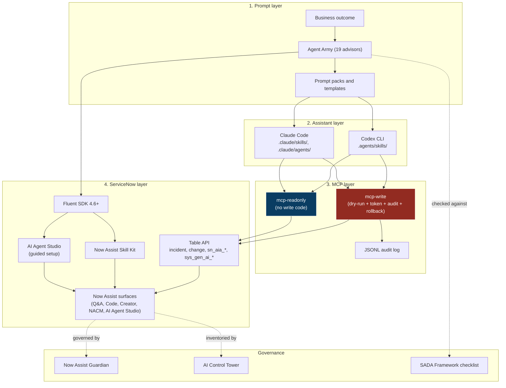
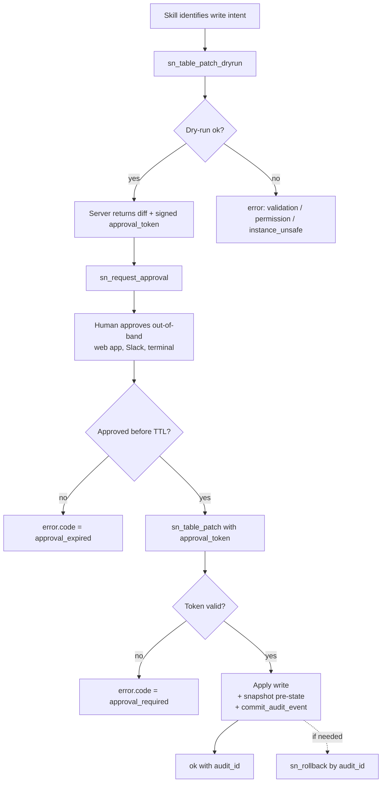

# Architecture

> Updated 2026-04-26. Reflects pnpm monorepo plus 2 MCP servers plus 19 advisory agents plus the optional Pierrondi EA private submodule pattern. Sources: [research-2026-04.md](research-2026-04.md), [mcp-landscape.md](mcp-landscape.md), [adr/ADR-001-stack.md](adr/ADR-001-stack.md), [adr/ADR-002-skill-tool-contract.md](adr/ADR-002-skill-tool-contract.md).

## Layers

The repository is built around five layers. Four are public, one is an optional private extension.

1. **Prompt layer** — the council of advisors plus reusable prompt packs and templates.
2. **Assistant layer** — Claude Code and Codex CLI discovery surfaces (`SKILL.md` files and subagent prompts).
3. **MCP layer** — two TypeScript MCP servers (`mcp-readonly` plus `mcp-write`).
4. **ServiceNow layer** — Fluent SDK 4.6+ first, AI Agent Studio guided setup as fallback, optional Table API adapter on `sn_aia_*`.
5. **Private layer (optional)** — git submodule with personal EA agent plus memory MCP plus mandatory sanitization step.

Each layer has a clear ownership contract. A layer above only consumes the contract of the layer below; it never reaches around it. That is the rule that keeps the read-only MCP read-only by construction and the write MCP auditable.

## High-level flow



## Repo layout

```text
servicenow-agent-army/
  agents/                  19 advisor markdown cards (council)
  workflows/               JSON workflow specs (steps + guardrails)
  catalog/                 agents.json + workflows.json (source of truth index)
  prompts/                 reusable prompt packs (per scenario)
  templates/               new-agent / new-workflow / new-skill scaffolds
  packages/
    mcp-readonly/          read-only MCP server (no write code paths)
    mcp-write/             guarded write MCP server (ADR-002)
    skill-contract/        shared types and Zod schemas
    fluent-helpers/        wrappers around @servicenow/sdk
    audit-log/             audit envelope and JSONL writers
  apps/
    web/                   Next.js 16 catalog plus audit viewer (Vercel)
    cli/                   Citty-based CLI (npm i -g @sn-army/cli)
  docs/
    adr/                   ADR-001 stack, ADR-002 contract, future ADRs
    best-practices/        itsm, itom, csm, now-assist
    research-2026-04.md    capability matrix and sources
    mcp-landscape.md       9-server inventory and gap analysis
    sada-framework.md      SADA v0.1
    architecture.md        this file
  scripts/                 validate-catalog.mjs, new-agent.mjs
  .agents/skills/          Codex-discoverable SKILL.md files
  .claude/skills/          Claude-discoverable SKILL.md files
  .claude/agents/          Claude subagent prompts
  private/                 (optional, gitignored) Pierrondi EA + memory MCP
```

## The 4 + 1 layers

### 1. Prompt layer

Static markdown plus JSON. No runtime code. This is the layer most contributors interact with.

- `agents/<id>.md` — one markdown card per advisor. Frontmatter declares role, mission, primaryUsers, triggers, outputs, guardrails. Cards are loaded by Claude subagents and referenced by skills.
- `workflows/<id>.json` — workflow spec with `steps`, `actors`, `inputs`, `outputs`, `guardrails`. Schema enforced by `scripts/validate-catalog.mjs`.
- `catalog/agents.json` and `catalog/workflows.json` — source-of-truth index. Every `path` field has to resolve to a real file, every workflow `steps` integer has to equal the length of `spec.steps` in the referenced JSON. The validator is the only gate.
- `prompts/` — reusable prompt packs (e.g., "incident triage canvas", "FSI compliance review").
- `templates/` — JSON shapes for new agents, workflows, and skills.

### 2. Assistant layer

Discovery surfaces for Claude Code and Codex CLI. The split is intentional: Claude resolves skills under `.claude/skills/`, Codex resolves them under `.agents/skills/`. Both copies stay in sync — the validator requires it.

- `.claude/skills/<name>/SKILL.md` — Claude Agent SDK discovery (research-2026-04.md §1.4). Frontmatter: `name`, `description`, plus our extended fields (`agents`, `mcp_servers`, `tools`, `guardrails`) per ADR-002.
- `.claude/agents/<name>.md` — Claude subagent prompts (CTA, BA, Guardrails Reviewer today; one per advisor planned).
- `.agents/skills/<name>/SKILL.md` — Codex CLI progressive disclosure (research-2026-04.md §2.1). Capped at ~2% of context, ~8000 chars. Frontmatter has to be dense.
- Skill descriptors are validated by Zod in `packages/skill-contract` and against the ADR-002 schema.

Codex CLI does not yet support MCP as of April 2026 (mcp-landscape.md §2). The `.agents/skills/` layout still ships because skill discovery is filesystem-only and useful even without MCP.

### 3. MCP layer

Two TypeScript binaries built on `@modelcontextprotocol/sdk`. Both ship `stdio` plus Streamable HTTP. SSE legacy is deprecated since spec 2025-03-26 and we will not implement it (mcp-landscape.md §1).

- **`packages/mcp-readonly`** — read-only by construction. No write code paths in the binary. Tools: `sn_table_query`, `sn_table_get`, `sn_table_describe`, `sn_aggregate_count`, `sn_search_schema`, `sn_list_ai_agents`, `sn_list_active_flows`. Reads `sn_aia_*` and `sys_gen_ai_*` directly without consuming Now Assist credits.
- **`packages/mcp-write`** — implements ADR-002 contract. Tools: `sn_table_patch_dryrun`, `sn_request_approval`, `sn_table_patch`, `sn_table_create`, `sn_table_delete`, `sn_rollback`, `commit_audit_event`. Each write tool refuses to act without a valid signed approval token bound to a specific dry-run hash.

Why two binaries:

1. Blast radius: discovery binary cannot mutate even under prompt injection.
2. Permission model alignment: maps to two ServiceNow service accounts (read-only vs change-bound), one OAuth client each.
3. Host limits: Cursor caps at ~40 tools per workspace; two narrow servers compose better than one fat 50+ tool server.
4. Compliance story: the write server can be CAB-reviewed independently of the read server.

The gap that defines us: across the nine inventoried public MCP servers (mcp-landscape.md §3), none implement dry-run plus signed approval token plus append-only audit plus per-record rollback as a first-class chain. The native Now Assist MCP Server (Zurich Patch 4) requires a Now Assist Pro Plus SKU and consumes one assist per call.

### 4. ServiceNow layer

Order of preference for writes:

1. **Fluent SDK 4.6+** for any artifact Fluent supports. Source-driven, typed, auto-ACL for AI Agents (research-2026-04.md §3.4).
2. **AI Agent Studio guided setup** for AI Agent Studio specifics not yet expressible in Fluent (e.g., complex NASK skills, trigger configurations not in `AiAgentWorkflow`). The repo generates the spec; a human applies it through the UI.
3. **Table API adapter** on `sn_aia_*` only when Fluent and guided setup are not enough. Gated by an explicit `--ai-agent-studio` flag plus the full ADR-002 approval flow. Risk: drift with Studio is real (research-2026-04.md §4.3).

Now Assist surfaces (Q&A, Code, Creator, NACM, AI Agent Studio, NASK) are deployment targets. The repo does not expose them as primary entry points; instead, the advisors point you at the right surface for the use case (Now Assist Coach is the routing brain).

### 5. Private layer (optional)

Power users can replicate the pattern Paulo runs locally: a git submodule under `private/` containing a personal EA agent loaded with account context, a memory MCP server, and a sanitization layer that scrubs proprietary or PII content before any output reaches the public council.

```text
private/                       # gitignored top-level entry
  agents/
    pierrondi-ea-agent.md      # personal EA mental model, local context
  mcp-memory/                  # personal memory MCP server (private to operator)
  sanitize/
    redact.ts                  # regex + LLM-based scrub layer
  config.local.json            # account-specific knobs
```

Mandatory rules for anyone copying the pattern:

1. The submodule URL is private and never logged.
2. Sanitization runs on every output the private agent emits before it crosses into the public council. No output bypasses.
3. The memory MCP is local-only (`stdio` transport, never exposed over HTTP).
4. Public commits never reference private content directly. Cross-cutting context flows by abstraction, not by quote.

The public repo never depends on the private submodule. Removing `private/` leaves the public app fully functional.

## Honest architecture (capability matrix)

Read this together with [research-2026-04.md](research-2026-04.md) §3-5.

| Capability | Surface | Deploy path | Confidence | Source |
| --- | --- | --- | --- | --- |
| Agentic workflow definition | AI Agent Studio | Fluent SDK 4.6 `AiAgentWorkflow` API + auto-ACL | confirmed | research §3.4 |
| Now Assist custom skill | NASK | Fluent SDK 4.6 NASK APIs (input types `glide_record`, `simple_array`, `json_object`, `json_array`) | confirmed | research §3.4 |
| Custom Action with typed step references | Workflow Studio | Fluent SDK 4.6 | confirmed | research §3.4 |
| AI Agent CRUD via REST | AI Agent Studio | No dedicated REST endpoint documented; Table API on `sn_aia_*` only with explicit flag and full approval flow | needs adapter | research §4.3 |
| AI agent invocation from external system | AI Agent Studio runtime | REST plus role `sn_ais.agent_user` plus plugin `com.glide.ai.runtime` | confirmed | research §4.3 |
| Now Assist Guardian policy | Guardian | UI-only configuration; policy-as-document in repo as companion | guided-only | research §5.4 |
| AI Control Tower lifecycle (onboard / change / offboard) | AI Control Tower | UI workflow; SADA orientation for institutional adoption | guided-only | research §4.5 |
| Build Agent (vibe coding) | Now Assist for Creator | UI-only; replicate locally via skills + Fluent | out-of-scope | research §5.2 |
| Front-end app (BYOF / React fullstack template) | Workspace + Service Portal | Fluent SDK 4.x BYOF | confirmed | research §3.3 |
| Schema introspection | Platform | `mcp-readonly` server, no Now Assist credit | confirmed (this repo) | mcp-landscape §5 |
| AI agent inventory and active flows | Platform | `mcp-readonly` server, queries `sn_aia_*` and `sys_gen_ai_*` directly | confirmed (this repo) | mcp-landscape §5 |
| Production write to any table | Platform | `mcp-write` server with dry-run + JWT approval + audit + rollback | unique to this repo | mcp-landscape §5 |
| Now Assist skill execution as a tool | Native MCP | Out-of-scope (paid SKU; we do not duplicate) | n/a | mcp-landscape §3 |

## MCP server contract

Full schema in [adr/ADR-002-skill-tool-contract.md](adr/ADR-002-skill-tool-contract.md). Highlights:

- Skill descriptor frontmatter declares `mcp_servers.required`, `tools.read`, `tools.write`, `guardrails.{side_effects, audit_required, approval_required, approval_ttl_minutes, rollback_supported}`. Validated by Zod (`packages/skill-contract`).
- Tool naming convention `mcp__<server>__sn_<resource>_<verb>[_<modifier>]` — wildcard-able in Claude Agent SDK `allowedTools` and Codex `enabled_tools`.
- Approval token is a HS256 JWT signed with `SN_AGENT_ARMY_SIGNING_KEY`. Payload binds dry-run hash, actor, target tool, scope (table, sys_ids, op), and TTL (default 15 min, max 60).
- Error envelope `{ok, data?, error?}` with closed enum of error codes (`auth`, `permission`, `validation`, `dryrun_required`, `approval_required`, `approval_expired`, `approval_mismatch`, `not_found`, `rate_limited`, `instance_unsafe`, `rollback_failed`, `internal`).

### Approval flow



Token storage is stateless by default (JWT autocontido). Optional ephemeral table `x_snw_agent_army_approval` for server-side replay protection if the customer requires it. Snapshot storage uses Vercel KV (TTL 30 days) or an in-instance attachment table, depending on operator choice.

## Production write policy

Non-negotiable rules pulled from [`CLAUDE.md`](../CLAUDE.md), [`SECURITY.md`](../SECURITY.md), and ADR-002:

- **Sub-prod first.** No production write from any agent path that has not run in a sub-prod clone with representative data.
- **Dry-run mandatory.** Every write tool refuses to apply without a successful prior dry-run that produced a matching token.
- **Explicit human approval.** Approval is out-of-band (web app, Slack, terminal). The agent does not approve its own writes.
- **Append-only audit.** Every MCP write call writes a structured event (actor, agent, skill, host, mcp_server, tool, instance, input_hash, dryrun_hash, approval_token_id, approved_by, output_summary, outcome, duration_ms, error). Audit log lives in JSONL plus an in-instance attachment table.
- **Per-record rollback.** `sn_rollback({audit_id})` reverts using the snapshot captured during dry-run.
- **`SN_AGENT_ARMY_PROD_GUARD=1`** environment flag required to run the write server against any host whose URL does not contain `dev`, `test`, `uat`, `sub`, or a configured non-prod allowlist. Heuristic returns `instance_unsafe` otherwise.
- **No silent failure.** Every error path returns a typed `ToolError` with a `code` and a human-readable message; the audit event records the failure.

The write server cannot be used without the guardrail chain. There is no "skip approval" mode. There is no "trust me" flag.

## Pierrondi EA private submodule (optional)

Some operators want to layer personal context on top of the public council without leaking it. The pattern works as a git submodule.

```mermaid
flowchart LR
  Operator[Operator request] --> Private[private/pierrondi-ea-agent\n(local context)]
  Private --> Memory[mcp-memory\n(local stdio only)]
  Private --> Sanitize[sanitize/redact.ts\n(regex + LLM scrub)]
  Sanitize --> PublicCouncil[Public Agent Army]
  PublicCouncil --> Output[Output to user]
  Memory -.never crosses.-> PublicCouncil
```

How to replicate (own version):

1. Create a private repo with your own EA agent card, memory MCP server, and sanitization rules.
2. Add it as a submodule under `private/` in your fork. The path is in `.gitignore` of the public repo by default; double-check before committing.
3. Wire the local entry point so every output from the private agent runs through `sanitize/redact.ts` before reaching any public skill or MCP server.
4. Keep the memory MCP on `stdio` only. Never expose it over HTTP, even on localhost.
5. Run `pnpm validate` after any change. The validator does not look inside `private/` but it does verify that the public surface still works without it.

The public repo will never document or depend on contents of any private submodule. The pattern is what we share, not the data.

## Decision references

- [adr/ADR-001-stack.md](adr/ADR-001-stack.md) — Node 22 LTS, pnpm 9, TypeScript 5.6, Next.js 16 on Vercel, Citty CLI, `@modelcontextprotocol/sdk` for MCP, Biome plus Vitest, Cloudflare Workers for MCP HTTP edge.
- [adr/ADR-002-skill-tool-contract.md](adr/ADR-002-skill-tool-contract.md) — skill descriptor schema, tool naming, approval flow, audit shape, error envelope, rollback model.
- [research-2026-04.md](research-2026-04.md) — capability matrix per surface, source-cited per claim, open questions for platform team.
- [mcp-landscape.md](mcp-landscape.md) — nine-server inventory, gap analysis, registry submission targets.
- [sada-framework.md](sada-framework.md) — SADA v0.1: four pillars, ten anti-patterns, 15-item review checklist for FSI Brazil.
