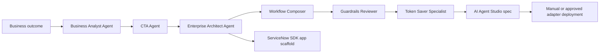

# Architecture

## Layers

1. Prompt layer
   - Reusable prompts in `prompts/`
   - Agent cards in `agents/`
   - Workflow specs in `workflows/`

2. Assistant layer
   - Codex repo skills in `.agents/skills/`
   - Claude skills in `.claude/skills/`
   - Claude subagent prompts in `.claude/agents/`

3. ServiceNow layer
   - AI Agent Studio for agents and agentic workflows
   - ServiceNow SDK/Fluent for supported source-driven app artifacts
   - Optional instance adapter after customer approval

4. Governance layer
   - Guardrails Reviewer
   - Human approval gates
   - Audit, rollback, and test plans

## Flow

## Deployment Principle

Do not write directly to a production ServiceNow instance from generated prompts. Any deployer must support:

- Sub-production first
- Dry run
- Explicit approval
- Audit trail
- Rollback plan
- Role and ACL verification
