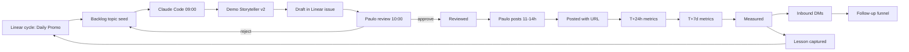

# Daily Promo Cycle — Linear Operating Workflow

> Operational doc for the "Daily Promo" cycle in Linear. One post a day, repeatable, measurable, with a clean handoff to follow-up.

## Why this cycle exists

LinkedIn engagement is the front door for ServiceNow Agent Army. Without a repeating cadence the repo goes silent, the council never reaches the buyer, and pipeline dries up. This cycle exists to push one signal a day, capture the response, and route it into the funnel.

Pierrondi EA voice rule: each post must answer "what number changes, and who owns it?" If a draft cannot, it is fallback content, not a feature post.

## Cycle setup

- Linear team: `Marketing — Agent Army`
- Cycle name: `Daily Promo`
- Length: 7 days, repeating
- Carryover: off (a missed day is logged, not rolled forward)
- Owner: Paulo (review + post). Claude Code is the drafter, not the publisher.

## Custom workflow states

| State | Owner | Definition of done |
| --- | --- | --- |
| Backlog | Claude Code | Topic seed exists. No draft yet. |
| Draft | Claude Code | Markdown draft + 1 visual asset, banned-words checked, LGPD checked. |
| Reviewed | Paulo | Paulo edited or approved as-is. Final copy is in the issue body. |
| Posted | Paulo | LinkedIn URL pasted in the issue. Timestamp logged. |
| Measured | Claude Code | T+24h and T+7d metrics added to the issue. Lessons captured. |

A post that never reaches `Posted` by 14h BR is logged as `dropped` with a reason. Three drops in a 7-day cycle triggers a retro.

## Daily timeline (BR timezone, America/Sao_Paulo)

| Time | Action | Tool |
| --- | --- | --- |
| 09:00 | Generate draft from rotation slot | Claude Code + Demo Storyteller v2 |
| 10:00 | Paulo reviews, edits, approves | Linear issue |
| 11:00 - 14:00 | Post to LinkedIn (BR + US engagement window) | LinkedIn manual |
| 14:30 | Repost to ServiceNow Community if topical | Manual |
| Next day 11:00 | Capture T+24h metrics on previous post | Claude Code |
| 7 days later | Capture T+7d metrics, mark `Measured` | Claude Code |

## Pre-post checklist (10 items)

Each `Reviewed` issue must have all ten checked before moving to `Posted`.

1. One outcome metric named in the post (number, direction, horizon).
2. One value figure or one cost-of-delay figure stated.
3. Banned-words scan clean (the global Pierrondi list).
4. LGPD review: no personal data, no client name without prior written consent, no internal screenshots that show real records.
5. CTA is specific (DM, comment with a use case, fork the repo, run the CLI). No "let me know your thoughts" filler.
6. One visual asset attached (screenshot, diagram, or 30-sec demo).
7. Repo link or web app link present.
8. Hashtag set: `#ServiceNow #NowAssist #FSI` plus one rotating slot tag.
9. Anti-vendor-pitch check: post advises, it does not sell.
10. Author attribution clear (Pierrondi EA voice or named guest agent).

## Rotation (weekly mix)

| Slot | Share | Source | Default angle |
| --- | --- | --- | --- |
| Pierrondi EA | 40% | `agents/pierrondi-enterprise-architect.md`, four-block contract | Outcome challenge of the week |
| Gallery cases | 25% | `gallery/0X-*` | One case retold in 90s, value figure leading |
| Now Assist | 20% | `docs/now-assist-playbook.md` | Surface fit, credit cost trade-off |
| SADA framework | 15% | `docs/sada-framework.md` | Architecture pattern, no theater |

Mondays default to Pierrondi EA. Fridays default to a Gallery case. Mid-week is the rotating mix.

## Post-post checklist

T+24h:

- Impressions, reactions, comments, profile views, DMs received.
- Comment replies drafted (Constructive Challenger voice, no filler).
- New DMs routed to `Follow-up` Linear project, stage `Sinal`.
- Repo stars and forks delta logged.

T+7d:

- Final reach + engagement.
- Inbound conversations counted (DMs, calls scheduled, RFP mentions).
- Lesson captured in one line: "what worked, what to drop, what to repeat."

## Measurement source of truth

| KPI | Source | Notes |
| --- | --- | --- |
| Impressions, reactions, profile views | LinkedIn analytics export | Manual paste until LinkedIn API token is wired |
| Repo stars, forks, contributors | GitHub REST | Captured by `scripts/metrics-snapshot.mjs` |
| Web app sessions | Vercel Analytics | Captured weekly by Paulo |
| Linear cycle metrics | Linear API | `Posted` count vs `Backlog` count, drop count |

LinkedIn API access is on the backlog. Until then, T+24h and T+7d numbers are pasted into the Linear issue manually. Do not block the cycle on automation.

## Backup plan (when the daily draft fails)

If `09:00` draft generation fails or the topic of the day collapses on review, fall back in this order:

1. Pull a Gallery case from the rotation that has not been used in the last 14 days.
2. Repost a Pierrondi EA four-block from `docs/demos/` with one updated number.
3. Post a "council in 60 seconds" carousel from the README hero.
4. If all three fail by 13:30 BR, log the day as `dropped` with reason. No filler post.

A dropped day is logged. A filler post is not allowed. Filler is worse than silence.

## Roles

| Role | Responsibility |
| --- | --- |
| Paulo | Review, post, reply to inbound, advance Linear stages |
| Claude Code | Draft, validate against banned words, capture metrics |
| Demo Storyteller v2 | Convert a Gallery case or four-block into a LinkedIn-ready post |
| Linear | Source of truth for state, owner, due date, history |

## Flow diagram

## Anti-patterns

- Posting without a number. The post will be skipped or low-engagement.
- Posting without a CTA. Inbound is what funds the cycle.
- Skipping the LGPD check. One mistake costs the brand a year of trust.
- Treating the cycle as content marketing. It is funnel ops. The metric that matters is `Inbound`, not `Reach`.

## Definition of cycle health

A 7-day cycle is healthy when:

- 6 of 7 days reached `Posted`.
- At least 2 inbound DMs from buyer personas.
- At least 1 discovery call scheduled.
- No banned-word slip and no LGPD slip.

If two consecutive cycles miss this bar, run a retro and revise the rotation.
