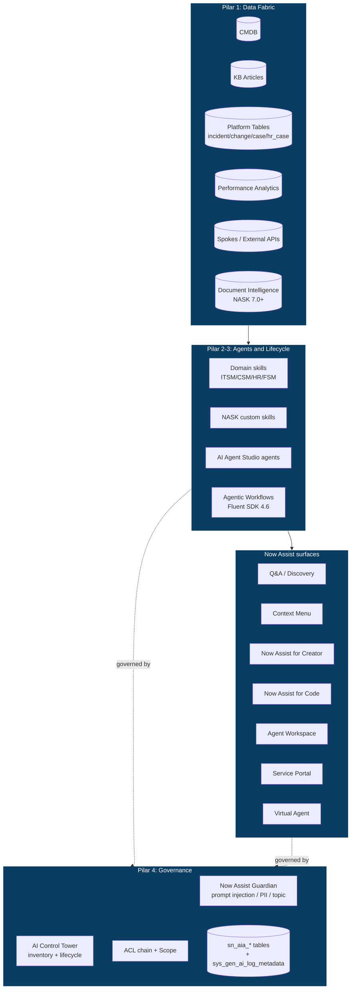

# SADA Framework — ServiceNow AI-Driven Architecture

> SADA v0.1 — Paulo Pierrondi, Apr 2026. Draft inicial. Feedback welcome via PR.
> Este documento NAO e ServiceNow product documentation. E uma opiniao estruturada de campo (TAE FSI Brasil) sobre como organizar IA na Now Platform sem virar shadow IT.

## Por que existe SADA

ServiceNow distribuiu Now Assist, AI Agent Studio, NASK, AI Control Tower, Guardian e Workflow Studio em camadas independentes. Cada cliente FSI brasileiro que vejo monta isso de forma diferente: ITSM ativa Now Assist for ITSM, CSM tenta agent custom no Skill Kit, Risco sobe Guardian sem policy versionada, Plataforma reclama de credit burn no fim do trimestre. O resultado tipico: 6-12 meses para mostrar valor, sem trilha clara de governanca, e a primeira auditoria interna abre exception.

SADA e um framework opinativo para resolver isso. Inspiracao: TOGAF (camadas + governanca explicita), AWS Well-Architected (pillars com trade-offs), e a realidade regulatoria FSI Brasil (BACEN Resolucao 4.893, LGPD, ISO 27001).

Objetivos:

- Forcar decisao explicita sobre dado, owner, lifecycle e guardrail antes de subir agente
- Dar um vocabulario comum entre Plataforma, LoBs, Risco e Auditoria
- Reduzir o tempo entre "ideia de agente" e "agente em producao com audit trail"
- Detectar shadow IT antes de virar problema regulatorio

Fora do escopo:

- Substituir AI Control Tower (SADA orienta o uso, nao replica)
- Definir politica de modelo BYOLLM (decisao de procurement / risco)
- Cobrir governanca de IA fora da Now Platform

---

## Principios SADA

1. **Source of truth e a Now Platform, nao o prompt.** Todo agente que decide tem que ler de tabela, KB ou metric source rastreavel. Prompt nao e dado.
2. **Owner antes de tool.** Nenhum agente sobe sem owner nominal humano (nao grupo) responsavel por retire/incident/audit.
3. **Guardrail e pre-requisito, nao melhoria.** PII, decisao financeira, customer-facing, ou cross-tenant sem Guardian + log = nao deploy.
4. **Lifecycle explicito.** Build > Test > Deploy > Monitor > Retire. Cada fase tem criterio de saida documentado.
5. **Customizacao e divida tecnica ate prova em contrario.** OOTB primeiro. Customizado so se houver business case medido.
6. **Auditavel por padrao.** Se voce nao consegue mostrar quem fez o que para uma auditoria do BACEN em 24h, o design esta errado.
7. **Credit budget e SLO.** Now Assist credits sao recurso finito. Cada agente tem teto mensal e alarme.
8. **Dry-run em prod-like obrigatorio.** Sub-prod com dados representativos antes de promover.

---

## Os 4 pilares

### Pilar 1: Data Fabric

O que: o conjunto de fontes que o agente le e escreve.

Componentes:

- CMDB (`cmdb_ci*`) — relationship truth para change/incident/discovery
- KB (`kb_knowledge`) — grounding para Q&A e Now Assist Discovery
- Now Platform tables (incident, change, sc_request, case, hr_case, etc.)
- Performance Analytics indicators
- Integracoes externas via Spokes / IntegrationHub
- Document Intelligence outputs (NASK 7.0+)
- BYOLLM grounding source [VERIFICAR FAMILY RELEASE]

Decisoes obrigatorias por agente:

| Decisao | Default SADA |
| --- | --- |
| Quais tabelas le | Listar explicitamente. Nao "any table the agent decides" |
| Quais tabelas escreve | Default: nenhuma direta. Escrita via Flow Designer com approval |
| KB scope | Tagged subset, nao "todo o KB" — reduz alucinacao |
| PII exposure | Marcar campos PII; Guardian sensitive topic obrigatorio |
| Cross-scope reads | Justificativa documentada; ACL exception aprovada |

Anti-pattern: agente que le `task` table inteira sem filtro de domain separation. Em multi-tenant FSI, vaza dado entre BUs.

### Pilar 2: Agent Ownership

O que: quem e responsavel pela vida util do agente.

Modelo RACI minimo:

| Papel | Responsabilidade |
| --- | --- |
| **Business Owner** | Define outcome, aprova mudanca de scope, recebe alerta de SLO breach |
| **Platform Owner** | Mantem o artefato (Fluent code, NASK skill, agent config), promove releases |
| **Risk/Compliance Reviewer** | Aprova mudanca em Guardian policy, revisa audit log trimestralmente |
| **End User Champion** | Coleta feedback de uso, reporta falha de qualidade |

Regra dura: agente sem **Business Owner nomeado (CPF/email, nao grupo)** nao roda em prod. Quando o owner sai da empresa, o agente entra em estado `pending-reassignment` com janela de 30 dias antes de retire automatico.

Anti-pattern FSI: "agente do time de fraud" sem nome. Quando o lider muda, ninguem sabe se ainda e usado, e a auditoria pega 18 meses depois.

### Pilar 3: Lifecycle

Estagios e criterio de saida:

| Estagio | Criterio de saida |
| --- | --- |
| **Build** | Spec aprovada (Business Owner), Fluent code ou Studio config commitada, Guardian policy escrita |
| **Test** | Sub-prod dry-run com >= 50 casos representativos, taxa de erro < 5%, audit log validado |
| **Deploy** | Approval gate (Business + Platform + Risk), rollback plan testado, credit budget configurado |
| **Monitor** | SLOs ativos (latencia, taxa de erro, satisfaction, credit burn), revisao mensal |
| **Retire** | Decisao formal (deprecated > X dias, replaced, owner reassigned > 30d). Export audit log antes de delete |

KPIs por estagio (sugestao):

- Build → Test: tempo medio (target < 10 dias para escopo simples)
- Test → Deploy: taxa de aprovacao first-pass (target > 70%)
- Deploy → Monitor: incidentes nas primeiras 2 semanas
- Monitor: SLO compliance trimestral
- Retire: agentes ativos sem uso ha > 90 dias (target = 0)

### Pilar 4: Governance

Componentes Now Platform:

- **Now Assist Guardian** (Zurich) — prompt injection, offensive, sensitive topics, BYOG. Source: [Now Assist Guardian docs](https://www.servicenow.com/docs/r/zurich/intelligent-experiences/now-assist-guardian.html), 2026-04-26.
- **AI Control Tower** — inventory, lifecycle events, cases & inquiries. Source: [AI Agent Studio overview](https://www.servicenow.com/docs/r/zurich/intelligent-experiences/ai-agent-studio.html), 2026-04-26.
- **ACL chain** — para tabelas que o agente toca (plataforma)
- **Update Sets / Application Scope** — boundary entre agentes
- **`sn_aia_*` tables** — auditoria via Table API readonly

Componentes externos ao produto:

- **Policy-as-document** versionada no repo (Guardian nao tem export API publica em Apr 2026 [VERIFICAR FAMILY RELEASE])
- **Quarterly review board** — Plataforma + Risco + LoBs revisam catalogo
- **Incident response playbook** — agente alucina ou vaza dado: quem desativa, em quanto tempo, qual log preserva

Triagem de risco (RACI x sensitivity):

| Sensitivity | Customer-facing? | Decisao financeira? | Approval gate |
| --- | --- | --- | --- |
| Low | No | No | Platform Owner |
| Medium | Yes ou No | No | Platform + Business |
| High | Yes | No, mas dado PII | Platform + Business + Risk |
| Critical | Yes | Yes (credit decision, payment, KYC) | Platform + Business + Risk + CISO sign-off |

---

## Anti-patterns FSI Brasil (visto em campo)

1. **"Agente do time" sem owner nomeado** — built for one team, vira shadow IT em 6 meses, ninguem sabe se ainda e usado
2. **Customizacao sobre OOTB Now Assist for ITSM** — time de plataforma reescreve resolution suggestion porque "queriamos personalizar". Resultado: backlog de bugs e perde upgrade path
3. **Guardian desligado em sub-prod por velocidade** — desenvolvedor liga so em prod e descobre que prompt injection passa porque so testou em ambiente sem Guardian
4. **NASK skill sem grounding** — prompt + LLM puro, alucina sobre processo interno do banco. Cliente recebe resposta errada sobre limite de cartao
5. **AI Agent que escreve em `incident` direto sem Flow Designer** — bypass de business rules de SLA, bypass de approval, audit trail incompleto
6. **Credit burn sem budget** — primeiro mes 200 USD, sexto mes 30k USD, CFO descobre na auditoria
7. **PII em prompt log** — desenvolvedor coloca CPF em prompt para teste, log fica exposto em `sys_gen_ai_log_metadata`. LGPD breach
8. **Cross-scope read sem justificativa** — agente de HR le tabelas de Risk porque "podia ser util". Sem ACL chain documentada, sem aprovacao
9. **Now Assist Pro Plus comprado sem use case definido** — licenca paga, ninguem ativou. Procurement chama Plataforma 9 meses depois para justificar renovacao
10. **Migracao Yokohama > Zurich sem regression test do agente** — Guardian comportamento mudou, agente passa a bloquear input legitimo, suporte vira fila

---

## Diagrama: SADA reference architecture

---

## SADA Review Checklist

Use no design review antes de promover para sub-prod. Cada item: PASS / FAIL / N-A com nota.

### Data Fabric (Pilar 1)
1. Lista explicita de tabelas que o agente le e escreve documentada
2. Campos PII marcados; Guardian sensitive topic configurado
3. KB scope limitado (tag/category), nao "all KB"
4. Cross-scope reads tem ACL exception aprovada e justificativa

### Ownership (Pilar 2)
5. Business Owner nominal (pessoa, nao grupo) com email confirmado
6. Platform Owner identificado para release management
7. Risk Reviewer atribuido se sensitivity >= Medium
8. Plano de reassignment caso owner saia (30 dias)

### Lifecycle (Pilar 3)
9. Spec versionada em repo (commit hash referenciavel)
10. Sub-prod test com >= 50 casos, taxa de erro < 5%
11. Rollback plan documentado e testado uma vez
12. SLOs definidos: latencia, taxa de erro, satisfaction, credit burn
13. Credit budget mensal configurado com alerta em 80%

### Governance (Pilar 4)
14. Guardian policy ativa em sub-prod (nao so prod)
15. Audit log validado: prompt, response, user, timestamp recuperaveis em 24h

---

## Como aplicar SADA no batalhao de agentes

Cada agente do repo (Business Analyst, CTA, Enterprise Architect, Workflow Composer, Guardrails Reviewer, Token Saver, agentes de domain) deve referenciar SADA assim:

- **Business Analyst Agent**: traduz outcome → identifica pilares afetados (qual data fabric, quem e owner, qual sensitivity tier)
- **Enterprise Architect Agent**: aplica os 4 pilares ao desenho, marca decisoes em ADR
- **Workflow Composer**: gera spec ja com lifecycle stage gates
- **Guardrails Reviewer**: usa SADA Review Checklist como input principal
- **Token Saver**: nao toca SADA — pilar de eficiencia, nao de governanca

---

## Open questions — proxima versao

1. Como integrar SADA com o lifecycle nativo do AI Control Tower sem duplicar trabalho? [VERIFICAR FAMILY RELEASE]
2. Qual o formato canonico de policy-as-document que sobreviva a importacao futura quando Guardian expor API?
3. Multi-instancia (DEV/SIT/UAT/PROD) — como versionar agent config quando Studio nao tem export plano? Fluent SDK 4.6 cobre AiAgentWorkflow, mas NASK skill complex ainda exige Studio
4. SADA em modo BYOLLM — quais ajustes nos pilares quando o LLM nao e o do Now Assist?

---

## Versao

- v0.1 (2026-04-26): primeiro draft. Quatro pilares, 10 anti-patterns, checklist de 15 itens.
- Backlog v0.2: adicionar template de spec por sensitivity tier, rubric de SLO por dominio (ITSM vs CSM vs HR), exemplos completos de agente passando pela checklist.

Feedback: PR no repo [paulopierrondi/servicenow-agent-army](https://github.com/paulopierrondi/servicenow-agent-army).
